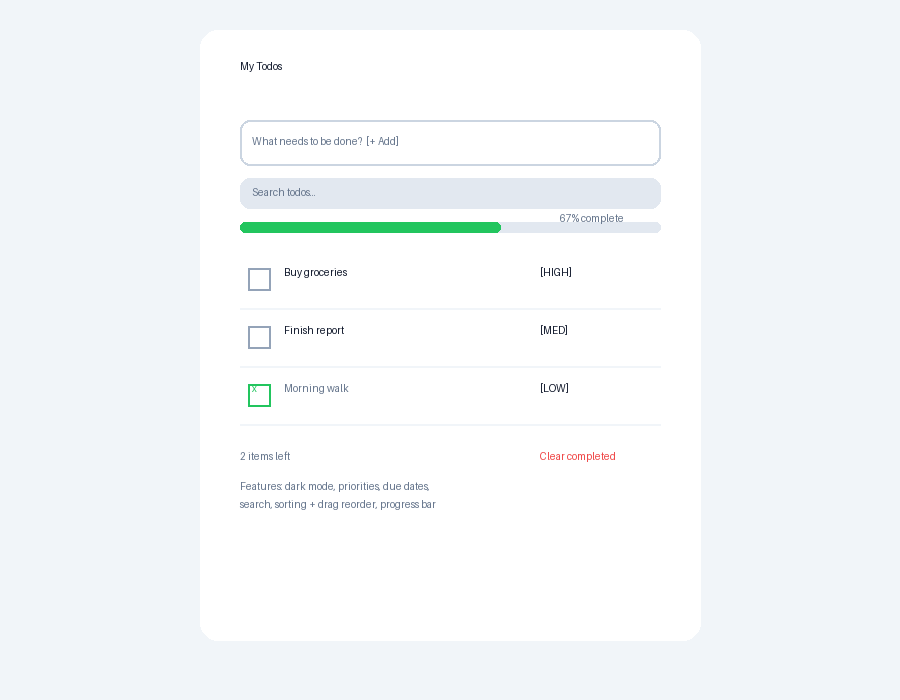

# ✅ simpleTodo

A simple, no-build todo app with dark mode, priorities, due dates, search, sorting, drag-to-reorder, and a progress bar. Just open `index.html` in a browser — no dependencies.



## Features

- ➕ Add / complete / delete todos
- ✏️ Double-click a todo to edit it
- 🌙 Dark / light theme toggle (saved)
- 🔴 Priority levels — Low / Medium / High (click badge to cycle)
- 📅 Due dates with ⚠️ overdue highlighting
- 🔍 Live search
- ↕️ Sort by priority, due date, or newest — plus drag-to-reorder in Manual mode
- 📊 Progress bar showing % complete
- 💾 Everything persists in `localStorage`

## Run

Open `index.html` in any browser, or serve the folder:

```sh
python -m http.server
```

## Files

| File | What |
|------|------|
| `index.html` | App markup |
| `style.css` | Styling + dark theme |
| `app.js` | App logic |
| `screenshot.png` | App screenshot |
